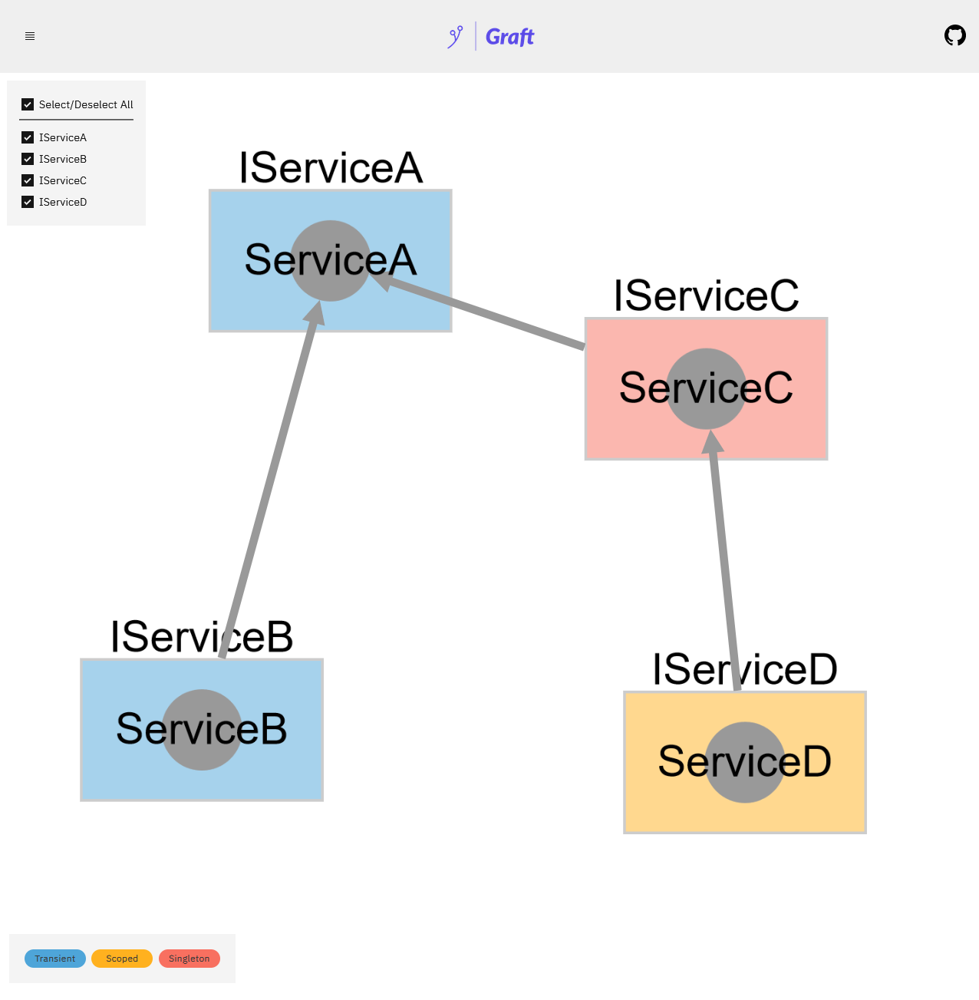
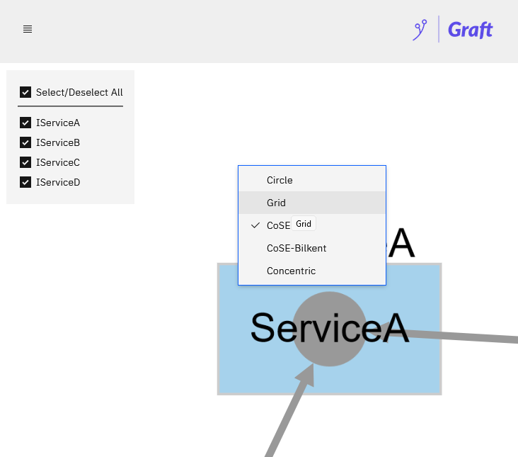

<p align="center">
  
</p>

# Graft

Like Swagger, but for visualizing your dependencies. Powered by Svelte + Cytoscape.js + .NET 6.

<p align="center">
  
  
</p>

## Usage

An example using the .NET 6 minimal APIs:

```csharp
using Graft;

var builder = WebApplication.CreateBuilder(args);

builder.Services.AddTransient<IServiceA, ServiceA>();
builder.Services.AddTransient<IServiceB, ServiceB>();

var app = builder.Build();

app.UseGraft(builder.Services);
```